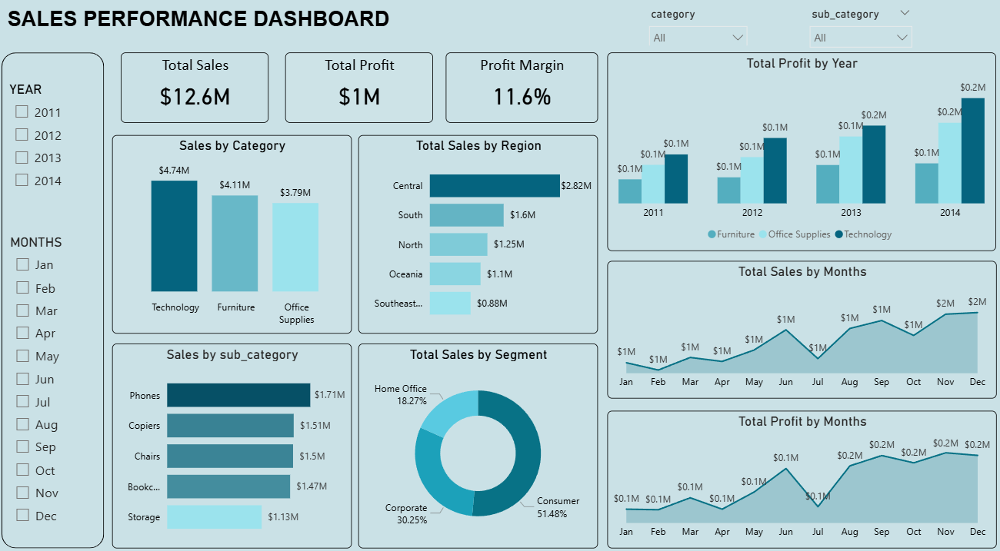

# Sales-performance-dashboard
##1. Project Title / Headline
Sales Performance Dashboard – Power BI

Developed an interactive Power BI dashboard to analyze sales performance, profit trends, customer segments, and regional insights using the Superstore dataset.

##2. Short Description / Purpose

This Power BI dashboard provides insights into sales performance using the Superstore dataset. It helps users quickly analyze sales trends, regional performance, and product categories to support data-driven decisions.

##3. Data Source

Dataset:Superstore dataset

The dataset includes information about:

-Sales transactions

-Product categories and sub-categories

-Customer segments

-Regional sales performance

-Order and shipping details

-Sales and profit values

##4.Features / Highlights

###Business Problem

Businesses require centralized reporting to monitor sales performance, identify profitable categories, and track regional trends for better decision-making.

###Goal of the Dashboard

To provide an interactive visualization tool for monitoring sales, profit, and performance trends.

###Key Visuals

-KPI Cards (Total Sales, Total Profit, Profit Margin)

-Sales by Category

-Sales by Region

-Sales by Sub-Category

-Sales by Segment

-Monthly Sales & Profit Trends

##5.Insights

-Technology category generated the highest overall sales and profit contribution
-Consumer segment accounted for the largest share of total revenue
-Sales and profit showed significant growth during the final quarter of the year
-Western and Central regions contributed higher sales performance compared to other regions

##6.Screenshot 

